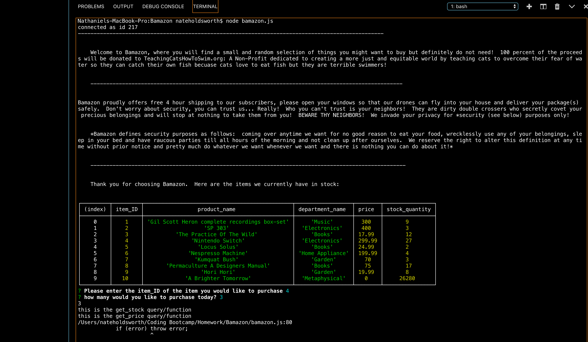

# Bamazon

This homework should have been easy but for some reason it wasn't.  I don't lnow why I am getting that error message about if (error) throw error.

anyway, I tried twice to build this homework and I kept the commented out code.  I tried to use the solution for greatbay as a template but that didn't work and then I got some help from my study group on Monday with Ray and Kristen and it was working better than it is now then.

I am including this screen shot to show how far I got and where it broke down.  I know it is something simple probably but I also know this weeks homework is much harder so I wanted to get started on that.

Please use bamazon.js not bamazon2.js to see all my struggles

Instructions

Bamazon is a Node based CLI (command line interface).  

1.  To use Bamazon you must first have Node installed on your computer along with git bash (if you have a Mac then the terminal works great)

2.  Make sure to run npm install to get the dependencies however just in case the two that you will need in order for the program to work(ish) are mysql and inquirer.  Both of these can be found on the NPM website.

3.  Once you have the required dependencies, simply run the command: node bamazon.js

4.  You will be shown a table of available items.  Enter the ID number of the Item you wish to buy and the quanity.

5.  From there, the app will be broken but you should be able to get at least that far.
